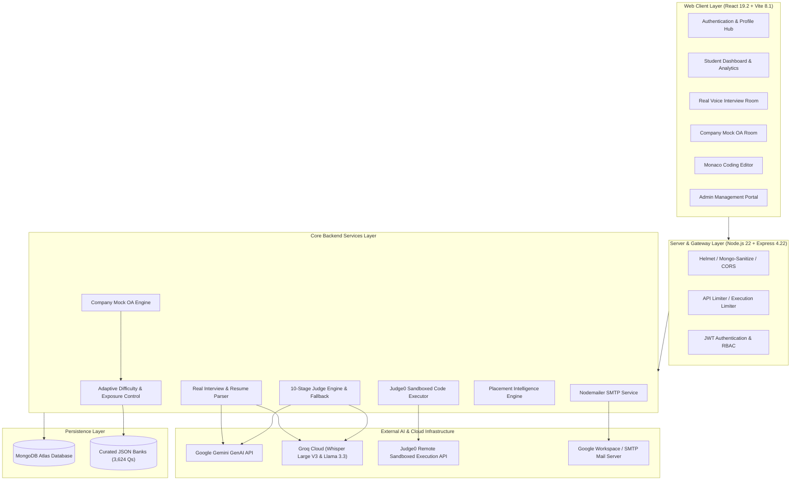

<p align="center">
  
</p>

<h1 align="center">PrepHire — AI Interview & Placement Assessment Platform</h1>

<p align="center">
  <b>A Production-Grade, Dual-Engine AI Platform for Resume-Driven Technical Interviews, Corporate Mock Assessments, In-Browser Sandboxed Code Execution & Placement Intelligence</b>
</p>

<p align="center">
  <a href="#-platform-at-a-glance"></a>
  <a href="#-technology-stack"></a>
  <a href="#-technology-stack"></a>
  <a href="#-technology-stack"></a>
  <a href="#-technology-stack"></a>
  <a href="#-technology-stack"></a>
  <a href="#-coding-assessment--execution-engine"></a>
  <a href="#-ai-powered-assessment-integrity"></a>
</p>

<p align="center">
  <a href="#-quickstart--installation"><b>⚡ Quickstart</b></a> •
  <a href="#-platform-at-a-glance"><b>🚀 Platform Overview</b></a> •
  <a href="#-dual-engine-architecture"><b>🧠 Dual-Engine System</b></a> •
  <a href="#-10-stage-ai-judge-engine"><b>⚖️ 10-Stage Judge</b></a> •
  <a href="#-api-specification--route-reference"><b>🌐 API Reference</b></a> •
  <a href="#-development-team"><b>👥 The Team</b></a>
</p>

<p align="center">
  
</p>

---

## 📊 Key Platform Metrics

<table align="center" width="100%">
  <tr>
    <td align="center" width="16.6%">
      <h3>🏢 9</h3>
      <p><b>Company Hiring Tracks</b><br /><sub>TCS, Infosys, Deloitte, Accenture, etc.</sub></p>
    </td>
    <td align="center" width="16.6%">
      <h3>📚 3,624+</h3>
      <p><b>Curated Questions</b><br /><sub>MCQ, Technical TITA & Coding Banks</sub></p>
    </td>
    <td align="center" width="16.6%">
      <h3>🎯 5</h3>
      <p><b>Interview Rounds</b><br /><sub>Aptitude, Project, Tech, Code, HR</sub></p>
    </td>
    <td align="center" width="16.6%">
      <h3>⚖️ 10</h3>
      <p><b>AI Judge Stages</b><br /><sub>Strict rubric & contradiction checks</sub></p>
    </td>
    <td align="center" width="16.6%">
      <h3>💻 5</h3>
      <p><b>Coding Languages</b><br /><sub>Java, Python, C++, C, JavaScript</sub></p>
    </td>
    <td align="center" width="16.6%">
      <h3>🧠 2</h3>
      <p><b>Assessment Engines</b><br /><sub>Real AI Voice + Company Mock OA</sub></p>
    </td>
  </tr>
</table>

---

## 🚀 Platform at a Glance

<table width="100%">
  <tr>
    <td width="50%" valign="top">
      <h3>🎙️ AI Voice Interviews</h3>
      <p>Natural conversational speech interviews powered by <b>Groq Whisper Large V3</b> speech-to-text with technical vocabulary biasing and adaptive noise calibration.</p>
    </td>
    <td width="50%" valign="top">
      <h3>🏢 Company Mock Assessments</h3>
      <p><b>9 dedicated corporate recruitment tracks</b> replicating real hiring patterns across Aptitude, conceptual Technical TITA, and Algorithmic Coding.</p>
    </td>
  </tr>
  <tr>
    <td width="50%" valign="top">
      <h3>⚖️ 10-Stage AI Judge Engine</h3>
      <p>Deterministic scoring pipeline with answer gating, requirement extraction, contradiction detection, and a <b>100% reliable algorithmic fallback</b>.</p>
    </td>
    <td width="50%" valign="top">
      <h3>💻 Sandboxed Coding IDE</h3>
      <p>Embedded <b>Monaco Editor</b> with automated boilerplate generation and <b>Judge0 REST API</b> test case execution for 5 programming languages.</p>
    </td>
  </tr>
  <tr>
    <td width="50%" valign="top">
      <h3>👁️ Client-Side ML Proctoring</h3>
      <p>Privacy-first <b>Google MediaPipe BlazeFace</b> WebAssembly face detection enforcing single-candidate presence, vacancy warnings, and multi-person alerts.</p>
    </td>
    <td width="50%" valign="top">
      <h3>📈 Placement Intelligence</h3>
      <p>Calculates candidate placement readiness percentages, company-specific probabilities, daily activity streaks, GitHub-style heatmaps, and leaderboards.</p>
    </td>
  </tr>
  <tr>
    <td width="50%" valign="top">
      <h3>🛡️ Security & Assessment Integrity</h3>
      <p>Forced browser fullscreen lock, tab-switch monitoring, JWT stateless authentication, bcrypt hashing, Mongo sanitization, and tiered rate limits.</p>
    </td>
    <td width="50%" valign="top">
      <h3>📄 Resume Mining & BYOK</h3>
      <p>Automated PDF/DOCX resume parsing generating candidate-specific project questions, with support for <b>Bring Your Own Key (BYOK)</b> sessions.</p>
    </td>
  </tr>
</table>

---

## 🖥️ Platform Experience

PrepHire delivers a unified, modern user experience designed for both candidates and placement administrators:

<p align="center">
  
  
</p>

<table width="100%">
  <tr>
    <td width="33%" valign="top">
      <b>Student Dashboard</b><br />
      Track placement readiness, ongoing tests, historical scores, daily streaks, and topic recommendations.
    </td>
    <td width="33%" valign="top">
      <b>Real AI Interview Room</b><br />
      Interactive speech-driven session with animated visualizers, live camera feed, and real-time STT.
    </td>
    <td width="33%" valign="top">
      <b>Monaco Coding Suite</b><br />
      VS Code-grade IDE with syntax highlighting, custom stdin runner, and test-case pass rate analytics.
    </td>
  </tr>
</table>

---

## 💡 Why PrepHire? (Problem & Solution)

<table width="100%">
  <thead>
    <tr>
      <th width="50%">Traditional Placement Preparation ❌</th>
      <th width="50%">The PrepHire Platform ✅</th>
    </tr>
  </thead>
  <tbody>
    <tr>
      <td><b>Generic Questioning</b>: Fixed question pools that ignore the student's actual projects, declared tech stacks, or individual strengths.</td>
      <td><b>Resume-Grounded Interviews</b>: CV parsing (PDF/DOCX) dynamically generates deep-dive questions probing listed projects, architecture choices, and tools.</td>
    </tr>
    <tr>
      <td><b>Fragmented Tools</b>: Students jump between disparate websites for coding problems, aptitude tests, and verbal mock interviews.</td>
      <td><b>Unified Assessment Engine</b>: Consolidates Aptitude MCQs, conceptual Technical TITA, and Monaco Coding into single timed assessments.</td>
    </tr>
    <tr>
      <td><b>Subjective & Unreliable Feedback</b>: Manual interviews are inconsistent; raw LLMs hallucinate or crash during third-party API outages.</td>
      <td><b>10-Stage Judge & Fallbacks</b>: Rigid rubric grading with contradiction detection, backed by a deterministic algorithmic fallback engine.</td>
    </tr>
    <tr>
      <td><b>Static Memorization</b>: Repeating tests produces the exact same question order, encouraging rote memorization over mastery.</td>
      <td><b>Zero-Repeat Exposure</b>: MongoDB-backed tracking ensures candidates never receive repeat questions until the entire pool is exhausted.</td>
    </tr>
    <tr>
      <td><b>Invasive Video Streaming</b>: Traditional proctoring uploads high-bandwidth camera streams to private servers, compromising privacy.</td>
      <td><b>Client-Side ML Proctoring</b>: MediaPipe BlazeFace runs entirely in WebAssembly on the candidate's browser — zero video uploads.</td>
    </tr>
  </tbody>
</table>

---

## 🧠 Dual-Engine Architecture

PrepHire is architected around two specialized, independent assessment engines designed for different stages of candidate preparation:

<p align="center">
  
</p>

### Engine Comparison Matrix

| Dimension | Engine 1: Real AI Voice Interview | Engine 2: Company Mock Assessment |
| :--- | :--- | :--- |
| **Primary Goal** | Personalized 1-on-1 technical interview simulation | Standardized corporate Online Assessment (OA) simulation |
| **Input Source** | Candidate Resume (PDF / DOCX) | 9 Curated Corporate Question Banks (3,624 Qs) |
| **Round Structure** | 5 Dynamic Rounds (Aptitude, Project, Tech, Code, HR) | Multi-Section (Aptitude MCQs + Technical TITA + Coding) |
| **Interaction Mode** | Conversational Speech (Groq Whisper STT) or Typing | Radio Selection (MCQ), Textarea (TITA), Monaco IDE (Code) |
| **Question Source** | Dynamic LLM generation with resume context | Pre-validated company question pools |
| **Difficulty Logic** | Follows candidate declared experience level | Real-time adaptive difficulty (Easy / Medium / Hard) |
| **Evaluation Method** | 10-Stage Judge Engine + Deterministic Fallback | Deterministic (MCQ), Key-Isolated AI / Fallback (TITA), Judge0 (Code) |
| **Session Control** | Standalone control room with webcam & voice meter | Fullscreen integrity gate with section countdown timer |

---

## 🏗️ System Architecture



<p align="center">
  
</p>

---

## 🎙️ Engine 1: Real AI Voice Interview

The **Real AI Interview Engine** replicates a high-stakes, 1-on-1 technical interview customized to each candidate's background:

```
[01 Resume Upload] ──> [02 Resume Mining] ──> [03 Dynamic Question Set] ──> [04 Voice / STT Session] ──> [05 10-Stage Judge] ──> [06 Scorecard PDF]
```

### 5-Round Interview Structure

| Round | Focus Area | Question Source | Evaluation Method |
| :--- | :--- | :--- | :--- |
| **1. Aptitude Round** | Foundational logic, math & problem solving | Core question bank | Deterministic instant scoring |
| **2. Project Round** | Architecture, design trade-offs, challenges | Extracted from candidate CV | 10-Stage Judge Engine against rubric |
| **3. Technical Round** | Language internals, frameworks, databases | Resume-declared technical skills | 10-Stage Judge Engine against rubric |
| **4. Coding Round** | Algorithmic problem solving in Monaco IDE | Coding question bank | Automated Judge0 test case evaluation |
| **5. HR Round** | Situational problem solving & soft skills | Behavioral question models | Communication & alignment scoring |

### Voice Speech-to-Text Pipeline (`/api/interview/stt`)
- **Engine**: Groq Whisper Large V3 with fallback to Whisper Large V3 Turbo.
- **Technical Biasing**: Injected prompt containing 40+ engineering terms (`React`, `Node.js`, `MongoDB`, `JWT`, `Kubernetes`, `Docker`) ensures accurate spelling of technical jargon.
- **Voice Activity Detection (VAD)**: Ambient noise floor calibration with pre-roll and post-roll buffering prevents word-clipping and accommodates natural pauses up to 8 seconds.

---

## 🏢 Engine 2: Company Mock Assessment

PrepHire offers **9 dedicated corporate assessment environments** modeled directly after official campus recruitment Online Assessments (OAs):

<table width="100%">
  <thead>
    <tr>
      <th>Company Track</th>
      <th>Target Role</th>
      <th>MCQ Pool</th>
      <th>Technical TITA</th>
      <th>Coding Pool</th>
      <th>Dedicated AI Client & Key</th>
    </tr>
  </thead>
  <tbody>
    <tr>
      <td><b>Celebal Technologies</b></td>
      <td>Software / Data Engineer</td>
      <td>238</td>
      <td>210</td>
      <td>0</td>
      <td><code>mockAiClient.js</code> (<code>MOCK_INTERVIEW_API_KEY</code>)</td>
    </tr>
    <tr>
      <td><b>TCS</b></td>
      <td>Ninja / Digital Developer</td>
      <td>175</td>
      <td>170</td>
      <td>35</td>
      <td><code>tcsAiClient.js</code> (<code>TCS_MOCK_KEY</code>)</td>
    </tr>
    <tr>
      <td><b>Wipro</b></td>
      <td>Elite / NLTH Candidate</td>
      <td>0</td>
      <td>380</td>
      <td>3</td>
      <td><code>mockAiClient.js</code> (<code>MOCK_INTERVIEW_API_KEY</code>)</td>
    </tr>
    <tr>
      <td><b>Accenture</b></td>
      <td>Associate Software Engineer</td>
      <td>210</td>
      <td>175</td>
      <td>32</td>
      <td><code>accentureAiClient.js</code> (<code>ACCENTURE_MOCK_KEY</code>)</td>
    </tr>
    <tr>
      <td><b>Benchmark IT Solutions</b></td>
      <td>Full-Stack Developer</td>
      <td>210</td>
      <td>160</td>
      <td>32</td>
      <td><code>benchmarkAiClient.js</code> (<code>BENCHMARK_MOCK_KEY</code>)</td>
    </tr>
    <tr>
      <td><b>Capgemini</b></td>
      <td>Software Analyst</td>
      <td>210</td>
      <td>160</td>
      <td>32</td>
      <td><code>shared2AiClient.js</code> (<code>MOCK_INTERVIEW_API_KEY2</code>)</td>
    </tr>
    <tr>
      <td><b>Cognizant</b></td>
      <td>GenC / GenC Next</td>
      <td>210</td>
      <td>160</td>
      <td>32</td>
      <td><code>shared2AiClient.js</code> (<code>MOCK_INTERVIEW_API_KEY2</code>)</td>
    </tr>
    <tr>
      <td><b>Deloitte</b></td>
      <td>Analyst / Tech Advisor</td>
      <td>201</td>
      <td>162</td>
      <td>32</td>
      <td><code>shared2AiClient.js</code> (<code>MOCK_INTERVIEW_API_KEY2</code>)</td>
    </tr>
    <tr>
      <td><b>Infosys</b></td>
      <td>SE / Specialist Programmer</td>
      <td>201</td>
      <td>162</td>
      <td>32</td>
      <td><code>shared2AiClient.js</code> (<code>MOCK_INTERVIEW_API_KEY2</code>)</td>
    </tr>
  </tbody>
  <tfoot>
    <tr>
      <th colspan="2"><b>Total Curated Bank:</b></th>
      <th><b>1,655 MCQs</b></th>
      <th><b>1,739 Tech Qs</b></th>
      <th><b>230 Coding Qs</b></th>
      <th><b>3,624 Total Questions</b></th>
    </tr>
  </tfoot>
</table>

### Key Corporate Mechanisms:
1. **Adaptive Difficulty Engine (`adaptiveDifficulty.js`)**: Evaluates real-time candidate accuracy. Candidates maintaining $\ge 75\%$ accuracy receive probing Hard-tier questions; candidates between $50\% - 74\%$ receive balanced Medium-tier questions; candidates $< 50\%$ receive foundational Easy-tier questions.
2. **Zero-Repeat Exposure Tracking (`questionExposureService.js`)**: Served question IDs are permanently logged in the MongoDB `QuestionExposure` collection per student per company. On future attempts, previously served questions are filtered out until the entire pool has been exhausted.
3. **API Key Isolation**: Independent environment variables for each company group prevent API quota exhaustion on one track from affecting others.

---

## ⚖️ 10-Stage AI Judge Engine

<p align="center">
  
</p>

Candidate answers are processed through a structured 10-stage evaluation pipeline in `interviewJudgeEngine.js`:

```
[01 Answer Gate] ──> [02 Question Analyzer] ──> [03 Requirements] ──> [04 Evidence] ──> [05 Semantics]
        │                                                                                   │
        ▼                                                                                   ▼
[10 Normalized Contract] <── [09 Score Calibration] <── [08 Contradictions] <── [07 Completeness] <── [06 Correctness]
```

### The 10 Judge Stages Explained
1. **Answer Gate (`judgeAnswerGate.js`)**: Intercepts empty answers, refusals (*"I don't know"*, *"skip"*), or conversational filler before executing AI calls, instantly returning zero marks and conserving tokens.
2. **Question Analyzer (`judgeQuestionAnalyzer.js`)**: Categorizes the required deliverable type (architectural design, syntax definition, trade-off analysis).
3. **Requirement Extraction (`judgeRequirementExtractor.js`)**: Breaks benchmark answers into verifiable technical sub-claims.
4. **Evidence Extraction**: Scans the candidate's answer for concrete claims, mechanisms, and architectural decisions.
5. **Semantic & Synonym Alignment**: Aligns technical phrasing (e.g., *"asynchronous event loop"* equates to *"non-blocking I/O execution"*).
6. **Correctness Evaluation**: Validates factual accuracy against gold-standard benchmarks.
7. **Completeness Evaluation**: Assigns proportional marks based on core requirement coverage.
8. **Contradiction Detection (`judgeScoreCalibrator.js`)**: Flags inverted claims (e.g., claiming HTTP is stateful by default) and applies penalty deductions.
9. **Score Calibration**: Enforces mathematical bounds ($0 \le \text{Score} \le \text{MaxMarks}$).
10. **Normalized Output Contract**: Delivers structured scores, strengths, weaknesses, and actionable feedback.

### Deterministic Algorithmic Fallback (`deterministicEvaluator.js`)
If remote AI APIs encounter rate limits or network downtime, the system routes evaluation to an internal rule-based engine. It analyzes keyword density, semantic phrase overlap, and grammatical coherence, guaranteeing that candidate assessments never crash.

---

## 💻 Coding Assessment & Execution Engine

<p align="center">
  
</p>

### Execution Architecture & Sandboxing
- **Monaco Code Editor**: Full-featured IDE with syntax highlighting, automatic indentation, dark/light themes, and keyboard shortcuts.
- **Language Support**:
  - **Java** (OpenJDK 13.0.1) — with automated `Solution.java` & `Main.java` class wrappers
  - **Python** (Python 3.8.1) — with standard input reader boilerplate
  - **C++** (GCC 9.2.0) — with `#include <iostream>` template
  - **C** (GCC 9.2.0) — with `#include <stdio.h>` template
  - **JavaScript** (Node.js 12.14.0) — with `fs.readFileSync` standard input reader
- **Sandboxed Compilation**: Executes via the remote **Judge0 REST API** or isolated Docker containers (`--network none`, `--read-only`, 256 MB memory limit, 10s timeout). Student code never executes directly on the Node.js server.
- **Test Runner**: Validates code against public sample cases and hidden test cases, returning runtime execution time (ms), memory footprint (KB), stdout, and compiler errors.

---

## 👁️ AI-Powered Assessment Integrity

<p align="center">
  
</p>

### Integrity & Anti-Cheating Controls
1. **Client-Side Face Detection (`personDetector.js`)**:
   - Uses **Google MediaPipe BlazeFace** running locally in WebAssembly/WebGL.
   - Zero video streaming — no camera frames are sent to the server.
   - Detects three distinct states:
     - `ONE_PERSON` (1 face) — Verified single candidate.
     - `NO_PERSON` (0 faces) — Candidate has left the camera frame.
     - `MULTIPLE_PEOPLE` (2+ faces) — Multi-person violation detected.
   - Uses a 3-frame rolling temporal filter (750 ms intervals) to eliminate lighting flickers.
2. **Fullscreen Lock Enforcement (`FullscreenExitOverlay.jsx`)**: Forces candidates into browser fullscreen mode; exiting fullscreen pauses the test and triggers an integrity alert.
3. **Tab-Switch & Blur Monitoring**: Listens for `visibilitychange` and window blur events, displaying warning notifications and logging infractions.
4. **Hardware Verification (`DeviceCheckModal.jsx`)**: Verifies working camera and microphone access with live audio volume meters before granting entry to interviews.

---

## 📊 Placement Intelligence & Analytics

<p align="center">
  
</p>

The **Placement Intelligence Engine** (`placementEngine.js`) converts raw performance data into actionable hiring insights:
- **Placement Readiness Score**: A weighted metric combining Aptitude, Technical, and Coding performance to evaluate overall campus placement readiness.
- **Company-Specific Readiness**: Estimates hiring probability across all 9 individual corporate recruitment tracks.
- **Activity Streaks & GitHub-Style Heatmaps**: Tracks daily candidate consistency with visual contribution grids.
- **Departmental Leaderboards**: University-wide and branch-specific rankings fostering healthy peer competition.
- **Gamified Achievement Unlocks**: Awards milestone badges for consistency, high scores, and problem completion.

---

## 🛠️ Technology Stack

<table width="100%">
  <tr>
    <td width="25%" valign="top">
      <h4>🎨 Frontend</h4>
      <ul>
        <li><b>React 19.2.7</b></li>
        <li><b>Vite 8.1.3</b></li>
        <li><b>Tailwind CSS 4.3.2</b></li>
        <li><b>Monaco Editor 0.56</b></li>
        <li><b>Framer Motion 12</b></li>
        <li><b>Recharts 3.10</b></li>
      </ul>
    </td>
    <td width="25%" valign="top">
      <h4>⚙️ Backend</h4>
      <ul>
        <li><b>Node.js 22.x</b></li>
        <li><b>Express 4.22.3</b></li>
        <li><b>MongoDB Atlas</b></li>
        <li><b>Mongoose 8.9.0</b></li>
        <li><b>JWT (jsonwebtoken 9.0)</b></li>
        <li><b>bcryptjs 2.4.3</b></li>
      </ul>
    </td>
    <td width="25%" valign="top">
      <h4>🤖 AI & Execution</h4>
      <ul>
        <li><b>Google Gemini GenAI</b></li>
        <li><b>Groq Whisper Large V3</b></li>
        <li><b>Groq Llama 3.3 70B</b></li>
        <li><b>Judge0 REST API</b></li>
        <li><b>MediaPipe BlazeFace</b></li>
        <li><b>Docker Containers</b></li>
      </ul>
    </td>
    <td width="25%" valign="top">
      <h4>📦 Utilities & Security</h4>
      <ul>
        <li><b>pdfjs-dist 4.10</b></li>
        <li><b>mammoth 1.12</b></li>
        <li><b>pdfkit 0.19</b></li>
        <li><b>Nodemailer 9.0</b></li>
        <li><b>Helmet 8.3</b></li>
        <li><b>express-rate-limit</b></li>
      </ul>
    </td>
  </tr>
</table>

---

## 🌐 API Specification & Route Reference

<details>
<summary><b>Click to expand full REST API endpoints reference</b></summary>
<br />

### 1. Authentication (`/api/auth`)
| Method | Endpoint | Description | Auth Required |
| :--- | :--- | :--- | :---: |
| `POST` | `/api/auth/signup` | Register student profile with academic metadata | No |
| `POST` | `/api/auth/login` | Authenticate student credentials & return JWT | No |
| `POST` | `/api/auth/admin-login` | Authenticate administrator credentials & return admin JWT | No |
| `POST` | `/api/auth/forgot-password` | Generate & email 6-digit OTP for password reset | No |
| `POST` | `/api/auth/verify-otp` | Verify OTP & issue temporary 15-minute reset token | No |
| `POST` | `/api/auth/reset-password` | Update account password using verified token | No |

### 2. Real AI Voice Interview (`/api/real-interview`)
| Method | Endpoint | Description | Auth Required |
| :--- | :--- | :--- | :---: |
| `POST` | `/api/real-interview/byok/set-session-key` | Bind custom Gemini/Groq key to session | Yes (`student`) |
| `POST` | `/api/real-interview/project/generate` | Mine CV & generate personalized project questions | Yes (`student`) |
| `POST` | `/api/real-interview/technical/generate`| Generate domain theory questions based on CV skills | Yes (`student`) |
| `POST` | `/api/real-interview/hr/generate` | Generate behavioral questions tailored to experience | Yes (`student`) |
| `POST` | `/api/real-interview/[round]/submit-answer` | Submit answer for 10-stage judge evaluation | Yes (`student`) |
| `POST` | `/api/real-interview/submit` | Finalize interview session & compute scorecard | Yes (`student`) |
| `GET` | `/api/real-interview/result/:sessionId` | Retrieve complete interview scorecard & feedback | Yes (`student`) |
| `GET` | `/api/real-interview/result/:sessionId/pdf` | Download official scorecard as a PDF document | Yes (`student`) |

### 3. Speech-to-Text Transcription (`/api/interview`)
| Method | Endpoint | Description | Auth Required |
| :--- | :--- | :--- | :---: |
| `POST` | `/api/interview/stt` | Transcribe voice audio buffer via Groq Whisper Large V3 | Yes (`student`) |

### 4. Company Mock Assessments (`/api/mock-interview`)
| Method | Endpoint | Description | Auth Required |
| :--- | :--- | :--- | :---: |
| `POST` | `/api/mock-interview/start` | Initialize company mock, filter exposure, return Qs | Yes (`student`) |
| `POST` | `/api/mock-interview/save` | Autosave answers, timer duration, and draft code | Yes (`student`) |
| `GET` | `/api/mock-interview/resume` | Restore unfinished assessment attempt state | Yes (`student`) |
| `POST` | `/api/mock-interview/submit` | Submit test, execute grading, generate scorecard | Yes (`student`) |
| `GET` | `/api/mock-interview/result/:attemptId` | Retrieve company mock score report & model answers | Yes (`student`) |
| `GET` | `/api/mock-interview/history` | List candidate's historical company mock attempts | Yes (`student`) |

### 5. Sandboxed Code Execution (`/api/code`)
| Method | Endpoint | Description | Auth Required |
| :--- | :--- | :--- | :---: |
| `GET` | `/api/code/languages` | Return supported compiler languages & configurations | No |
| `POST` | `/api/code/run` | Execute code against custom stdin input via Judge0 | Yes (`student`) |
| `POST` | `/api/code/submit` | Execute code against all problem test cases & return score | Yes (`student`) |
| `GET` | `/api/code/submission/:id` | Retrieve submission status, stdout, runtime, and memory | Yes (`student`) |

### 6. Placement Intelligence (`/api/placement`)
| Method | Endpoint | Description | Auth Required |
| :--- | :--- | :--- | :---: |
| `GET` | `/api/placement/dashboard` | Fetch overall readiness score, streaks, and heatmap | Yes (`student`) |
| `GET` | `/api/placement/company-readiness` | Retrieve readiness percentages across all 9 companies | Yes (`student`) |
| `GET` | `/api/placement/leaderboard` | View university & departmental candidate rankings | Yes (`student`) |
| `GET` | `/api/placement/achievements` | Fetch candidate unlocked gamification badges | Yes (`student`) |

### 7. Admin Management Portal (`/api/admin`)
| Method | Endpoint | Description | Auth Required |
| :--- | :--- | :--- | :---: |
| `GET` | `/api/admin/stats` | High-level system statistics (candidates, tests, passes) | Yes (`admin`) |
| `GET` | `/api/admin/students` | Search, filter, and paginate all student profiles | Yes (`admin`) |
| `GET` | `/api/admin/analytics/overview` | Departmental performance and score distributions | Yes (`admin`) |
| `POST` | `/api/admin/tests/create` | Compose and publish custom assessments | Yes (`admin`) |
| `POST` | `/api/admin/mock-questions` | Add new questions to company mock pools | Yes (`admin`) |
| `GET` | `/api/admin/audit-logs` | Retrieve operational and security audit events | Yes (`admin`) |

</details>

---

## 🗄️ Database Architecture

<details>
<summary><b>Click to expand MongoDB Mongoose Entities</b></summary>
<br />

The application utilizes MongoDB Atlas modeled through Mongoose schemas:
- **`User`**: Candidate and administrator identities. Stores email, hashed password, role (`student` / `admin`), academic details (college, department, year), resume URLs, parsed resume text, and password reset OTP states.
- **`Interview`**: Represents an instance of the 5-round Real Interview. Tracks candidate ID, resume metadata, session status (`IN_PROGRESS`, `COMPLETED`), round completion flags, and cumulative score metrics.
- **`RealInterviewResult`**: Stores granular evaluations for each round question in a Real Interview. Includes candidate verbal answers, transcriptions, maximum marks, earned scores, completeness ratings, and AI constructive feedback.
- **`CompanyMockAttempt`**: Represents an attempt at one of the 9 company mock hiring assessments. Stores selected company, section-wise answers (Aptitude, Technical, Coding), timer duration remaining, draft code buffers, and sectional mark breakdowns.
- **`QuestionExposure`**: Records question IDs already presented to a specific candidate for a specific company track. Guarantees zero question repetition until the entire question bank has been cycled.
- **`CodingQuestion`**: Algorithmic problem repository. Stores problem titles, difficulty levels, descriptions, constraints, input/output specifications, starter templates per language, and test cases.
- **`CodingSubmission`**: Records code submissions executed through Judge0. Stores submitted code, selected language, compilation status, runtime duration (ms), memory consumed (KB), test cases passed, and total score.
- **`Test` & `TestAssignment`**: Admin-composed custom tests and their cohort assignment rules, scheduling windows, and allotted durations.
- **`AchievementUnlock`**: Gamification badges unlocked by candidates based on practice consistency, score thresholds, and interview milestones.
- **`AuditLog`**: Security and administrative audit trail recording admin actions, test creations, student modifications, and system events.

</details>

---

## ⚡ Quickstart & Installation

### Prerequisites
- **Node.js**: v18.0.0 or higher (v22.x recommended)
- **npm**: v9.0.0 or higher
- **MongoDB**: Active MongoDB Atlas cluster or local MongoDB instance

### Installation & Launch

```bash
# 1. Clone the repository
git clone https://github.com/Tushar-3612/AI-Interview-Platform.git
cd AI-Interview-Platform

# 2. Install backend dependencies
npm install

# 3. Install frontend dependencies
cd frontend
npm install
cd ..

# 4. Configure environment variables (create .env from template below)
cp .env.example .env

# 5. Start Backend Server (Port 5000)
npm run dev

# 6. Start Frontend Server in a second terminal (Port 5173)
npm --prefix frontend run dev
```

Navigate to `http://localhost:5173` in any modern web browser.

---

## 🔑 Environment Configuration

<details>
<summary><b>Click to expand safe .env template</b></summary>
<br />

> [!CAUTION]
> **Security Notice**: Never commit real API keys, database credentials, or email passwords to version control. Use the placeholder format below.

```env
# ==============================================================================
# SERVER CONFIGURATION
# ==============================================================================
PORT=5000
NODE_ENV=development

# ==============================================================================
# DATABASE CONFIGURATION
# ==============================================================================
MONGO_URI=mongodb+srv://<username>:<password>@cluster0.example.mongodb.net/prephire_db?retryWrites=true&w=majority

# ==============================================================================
# AUTHENTICATION & SECURITY
# ==============================================================================
JWT_SECRET=your_jwt_secret_key_minimum_32_characters_long
JWT_EXPIRE=7d

# ==============================================================================
# AI PROVIDER CREDENTIALS
# ==============================================================================
AI_PROVIDER=gemini
GEMINI_API_KEY=your_google_gemini_api_key
AI_API_KEY=your_groq_cloud_api_key

# ==============================================================================
# COMPANY MOCK KEY-ISOLATION CREDENTIALS
# (Separate keys prevent cross-company rate limit exhaustion)
# ==============================================================================
MOCK_INTERVIEW_API_KEY=your_dedicated_key_for_celebal_wipro
MOCK_INTERVIEW_API_KEY2=your_dedicated_key_for_shared_tier2
TCS_MOCK_KEY=your_dedicated_key_for_tcs
ACCENTURE_MOCK_KEY=your_dedicated_key_for_accenture
BENCHMARK_MOCK_KEY=your_dedicated_key_for_benchmark

# ==============================================================================
# CODE EXECUTION (JUDGE0 REST API)
# ==============================================================================
JUDGE0_API_URL=https://judge0-ce.p.rapidapi.com
JUDGE0_API_KEY=your_rapidapi_judge0_key
JUDGE0_API_HOST=judge0-ce.p.rapidapi.com

# ==============================================================================
# TRANSACTIONAL EMAIL & SMTP (OPTIONAL / RECOMMENDED)
# ==============================================================================
SMTP_HOST=smtp.gmail.com
SMTP_PORT=587
SMTP_SECURE=false
SMTP_USER=your_institution_email@gmail.com
SMTP_PASS=your_google_app_password_16_characters
SMTP_FROM_NAME="PrepHire - AI Interview Platform"
```

</details>

---

## 👥 Development Team

PrepHire is engineered by the core development team at Sanjivani College of Engineering:

<table align="center" width="100%">
  <tr>
    <td align="center" width="33%">
      <br />
      <b>Tushar Nagare</b><br />
      <sub>Full Stack Lead • Lead Developer</sub><br />
      <small>System architecture, AI Judge engine, backend pipeline & full-stack integration.</small>
    </td>
    <td align="center" width="33%">
      <br />
      <b>Roshan Langhi</b><br />
      <sub>Frontend Developer • UI/UX & React</sub><br />
      <small>Client architecture, responsive interfaces, Monaco IDE integration & visual design.</small>
    </td>
    <td align="center" width="33%">
      <br />
      <b>Amol Lende</b><br />
      <sub>Backend & Systems • Node & MongoDB</sub><br />
      <small>Database architecture, question exposure control, SMTP services & data modeling.</small>
    </td>
  </tr>
</table>

---

<p align="center">
  <b>PrepHire — AI Interview Platform</b><br />
  <i>Engineered for Technical Interview Simulation & Automated Campus Placement Assessments</i>
</p>
