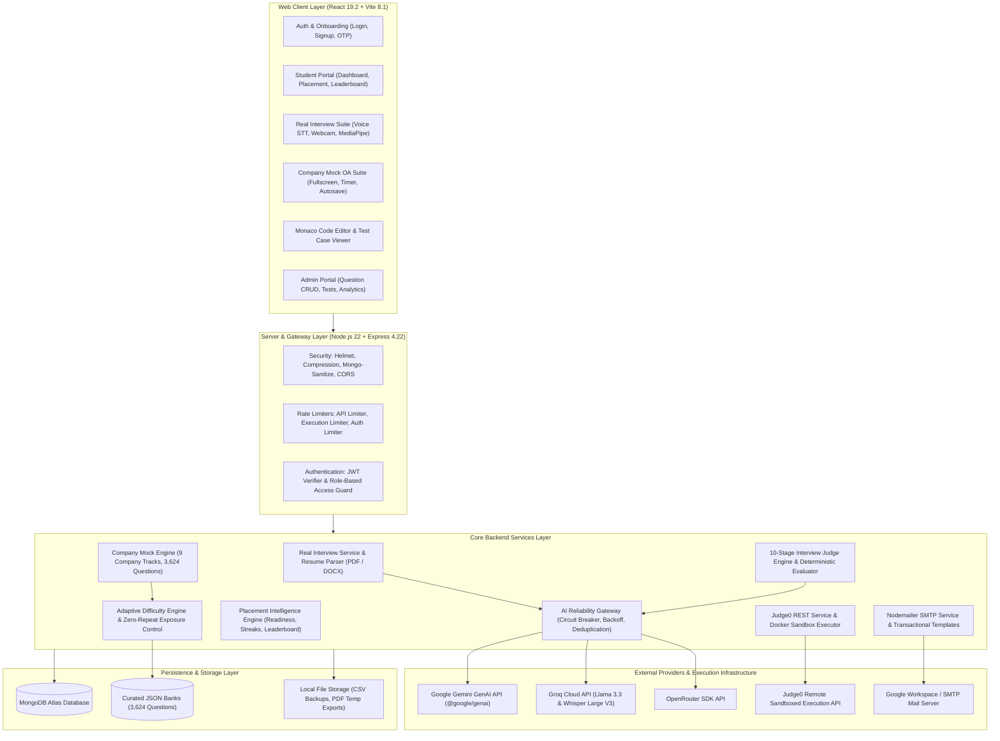
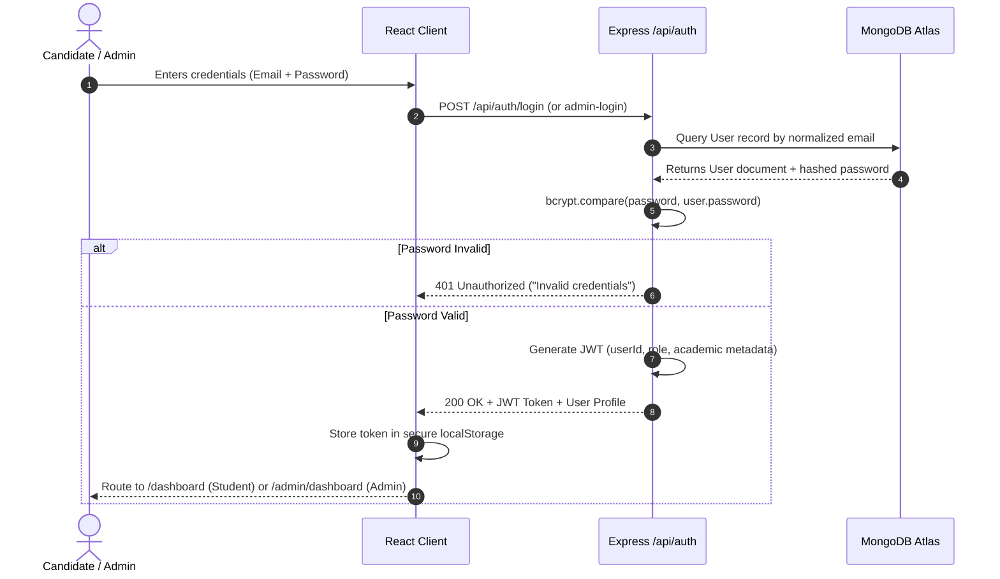
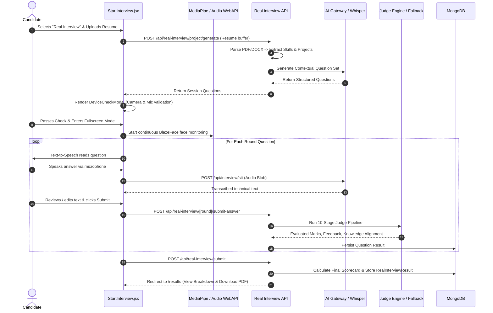
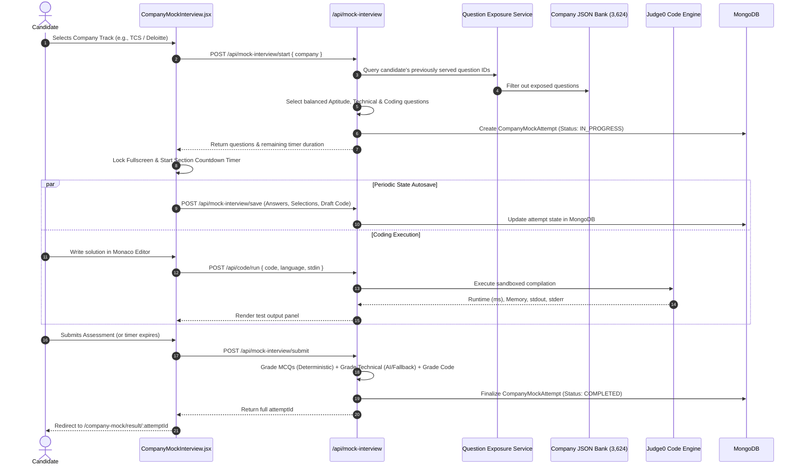
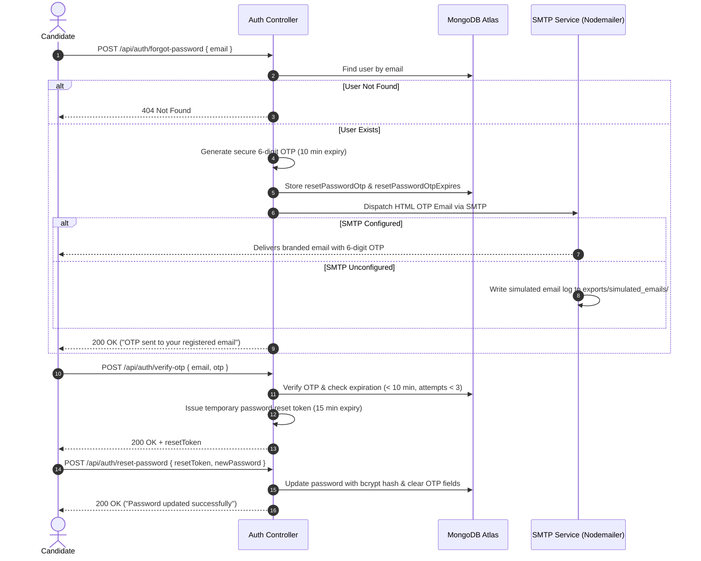

<p align="center">
  
</p>

<h1 align="center">PrepHire — AI Interview & Placement Assessment Platform</h1>

<p align="center">
  <b>A Production-Grade Full-Stack Platform Integrating Resume-Driven AI Speech Interviews, Standardized Corporate Online Assessments, In-Browser Code Execution, and Placement Analytics</b>
</p>

<p align="center">
  
  
  
  
  
  
  
  
</p>

---

## 📋 Table of Contents

- [1. Project Overview](#1-project-overview)
- [2. Problem Statement & Solution](#2-problem-statement--solution)
- [3. What Was Built — Dual-Engine Platform](#3-what-was-built--dual-engine-platform)
  - [Engine 1: Real AI Voice Interview Engine](#engine-1-real-ai-voice-interview-engine)
  - [Engine 2: Company Mock Assessment Engine](#engine-2-company-mock-assessment-engine)
- [4. Major Features](#4-major-features)
- [5. System Architecture](#5-system-architecture)
- [6. End-to-End System Workflows](#6-end-to-end-system-workflows)
- [7. Technology Stack](#7-technology-stack)
- [8. Repository Structure](#8-repository-structure)
- [9. Database & Data Model Architecture](#9-database--data-model-architecture)
- [10. API Specification & Route Reference](#10-api-specification--route-reference)
- [11. AI Architecture & Reliability Pipeline](#11-ai-architecture--reliability-pipeline)
- [12. Coding Engine & Execution Sandbox](#12-coding-engine--execution-sandbox)
- [13. Proctoring, Security & Assessment Integrity](#13-proctoring-security--assessment-integrity)
- [14. Transactional Email & Password Recovery](#14-transactional-email--password-recovery)
- [15. Setup & Installation](#15-setup--installation)
- [16. Environment Configuration (Safe Template)](#16-environment-configuration-safe-template)
- [17. Engineering Highlights](#17-engineering-highlights)

---

## 1. Project Overview

**PrepHire (AI Interview Platform)** is an enterprise-grade web application built to simulate high-fidelity technical interviews and standardized campus recruitment assessments. It bridges the gap between passive academic study and real-world hiring standards by combining resume-contextual AI verbal interviews, company-patterned Online Assessments (OAs), an integrated multi-language coding IDE, client-side ML proctoring, and placement intelligence analytics.

The platform serves two primary user personas:
1. **Students & Job Applicants**: Candidates seeking targeted, bias-free technical interview practice with instant rubric-based evaluation, detailed model solutions, historical progress tracking, and corporate hiring mock assessments.
2. **Educators, Placement Officers & Administrators**: Institutions requiring tools to create customized assessments, assign tests to cohorts, track department-level analytics, monitor student attempt history, and curate question banks.

---

## 2. Problem Statement & Solution

### The Challenge
- **Disconnected Interview Practice**: Conventional mock interviews are either manual (costly, hard to schedule, subjective) or rely on static generic questions that ignore the candidate's actual projects, declared tech stack, and background.
- **Fragmented Preparation Tools**: Students typically navigate multiple disconnected platforms — one for LeetCode-style algorithms, another for aptitude MCQs, and another for behavioral prep.
- **Unreliable AI Scoring**: Naive LLM evaluations suffer from non-deterministic grading, hallucinations, token budget exhaustion, and sudden provider outages.
- **Lack of Standardized Corporate Patterns**: College placement drives follow strict hiring assessment structures (e.g., TCS Ninja/Digital, Infosys SP/SE, Accenture ASE) that generic prep platforms fail to replicate.

### The PrepHire Solution
- **Resume-Grounded Interviews**: PDF and DOCX resumes are mined to extract declared frameworks, databases, libraries, and projects, feeding dynamically generated, tailored interview rounds.
- **Dual Assessment Architecture**: Unifies personalized, speech-driven verbal interviews with 9 corporate hiring tracks containing 3,624 validated questions across Aptitude, Technical (TITA), and Coding.
- **10-Stage Evaluation & Deterministic Fallback**: Candidate answers pass through a structured judge pipeline that extracts claims, identifies contradictions, normalizes scores, and seamlessly falls back to local algorithmic NLP when AI APIs are unreachable.
- **Zero-Repeat Exposure Tracking**: Candidate question histories are tracked in MongoDB, ensuring fresh questions across consecutive attempts until the question pool is legitimately exhausted.
- **Client-Side ML Proctoring**: MediaPipe BlazeFace WebAssembly models run directly in the browser to detect camera tampering, candidate absence, and multiple faces without transmitting video feeds to external servers.

---

## 3. What Was Built — Dual-Engine Platform

```
                                      ┌──────────────────────────────────────────────────────────┐
                                      │                      PREPHIRE USER                       │
                                      └────────────────────────────┬─────────────────────────────┘
                                                                   │
                                                ┌──────────────────┴──────────────────┐
                                                ▼                                     ▼
                                  ┌───────────────────────────┐         ┌───────────────────────────┐
                                  │   STUDENT AUTH / LOGIN    │         │     ADMIN RBAC PORTAL     │
                                  └─────────────┬─────────────┘         └─────────────┬─────────────┘
                                                │                                     │
                                                ▼                                     ▼
                                  ┌───────────────────────────┐         ┌───────────────────────────┐
                                  │     STUDENT DASHBOARD     │         │   ADMIN CONTROL CENTER    │
                                  └─────────────┬─────────────┘         └───────────────────────────┘
                                                │
                       ┌────────────────────────┴────────────────────────┐
                       ▼                                                 ▼
        ┌─────────────────────────────┐                   ┌─────────────────────────────┐
        │   ENGINE 1: REAL AI VOICE   │                   │    ENGINE 2: COMPANY MOCK   │
        │      INTERVIEW SYSTEM       │                   │      ASSESSMENT SYSTEM      │
        └──────────────┬──────────────┘                   └──────────────┬──────────────┘
                       │                                                 │
        • Resume Upload (PDF / DOCX)                      • 9 Corporate Hiring Tracks
        • Skill & Project Extraction                      • 3,624 Curated Question Banks
        • 5 Dynamic Rounds:                               • Multi-Section Flow:
          1. Aptitude (MCQ)                                 - Aptitude MCQs (Instant Scoring)
          2. Resume / Project Deep-Dive                     - Technical TITA (AI Evaluated)
          3. Technical Domain Theory                        - Algorithmic Coding Round
          4. Coding Challenge (Monaco IDE)                • Adaptive Difficulty (Easy/Med/Hard)
          5. HR & Behavioral Assessment                   • Zero-Repeat Question Exposure
        • Groq Whisper Speech-to-Text                     • Fullscreen Integrity Gate
        • 10-Stage Unified Judge Engine                   • MongoDB Autosave & Resume State
        • Comprehensive PDF Scorecard                     • Detailed Sectional Analytics
```

### Engine 1: Real AI Voice Interview Engine
The Real Interview Engine replicates a real-world, multi-round technical interview:
- **Resume Mining**: Parses candidate CVs using `pdfjs-dist` and `mammoth` to extract technical proficiencies, architectures, and project descriptions.
- **Five Dedicated Rounds**:
  1. *Aptitude Round*: Core foundational problem solving.
  2. *Resume / Project Round*: Architecture and trade-off questioning based on candidate projects.
  3. *Technical Round*: Conceptual deep-dive into candidate-declared tech stacks.
  4. *Coding Round*: Algorithmic problem solving inside Monaco IDE.
  5. *HR Round*: Behavioral evaluation assessing communication and cultural alignment.
- **Speech-to-Text (STT)**: High-accuracy verbal input powered by Groq Whisper Large V3 with technical vocabulary biasing and adaptive silence detection.
- **Text-to-Speech (TTS)**: Conversational audio synthesis with browser audio visualizers.
- **Evaluation & Scoring**: Processed through the 10-stage `interviewJudgeEngine.js` with structured rubrics, contradiction detection, and downloadable PDF reports.

### Engine 2: Company Mock Assessment Engine
The Company Mock Engine delivers standardized corporate assessment simulations modeled after leading IT and consulting employers:
- **9 Dedicated Corporate Hiring Tracks**:
  - **Celebal Technologies**: Software / Data Engineer (448 questions)
  - **TCS**: Ninja / Digital Developer (380 questions)
  - **Wipro**: Elite / NLTH Candidate (383 questions)
  - **Accenture**: Associate Software Engineer (417 questions)
  - **Benchmark IT Solutions**: Full-Stack Software Developer (402 questions)
  - **Capgemini**: Software Analyst / Engineer (402 questions)
  - **Cognizant**: GenC / GenC Next Engineer (402 questions)
  - **Deloitte**: Analyst / Technology Advisor (395 questions)
  - **Infosys**: Systems Engineer / Specialist Programmer (395 questions)
- **Question Formats**:
  - *Multiple Choice Questions (MCQs)*: Objective single-correct questions with instant deterministic scoring.
  - *Type-In-The-Answer (TITA) Technical Questions*: Free-text conceptual explanations evaluated by isolated AI clients against gold-standard rubrics (`expectedAnswer`, `explanation`, `betterAnswer`).
  - *Coding Challenges*: Multi-language algorithmic challenges with automated test-case evaluation.
- **Adaptive Difficulty**: Real-time calibration adjusts question tiers (Easy / Medium / Hard) based on continuous candidate accuracy.
- **Zero-Repeat Exposure**: MongoDB-backed tracking excludes previously served questions for that student until the entire bank has been exhausted.

---

## 4. Major Features

### Authentication & Authorization
- **Role-Based Access Control (RBAC)**: Distinct permissions for `student` and `admin` roles enforced via server-side middleware (`authMiddleware.js`, `authorizeRoles`).
- **Secure Password Hashing**: Passwords stored using `bcryptjs` with 10 salt rounds.
- **Stateless Session Tokens**: Authenticated requests signed using JSON Web Tokens (JWT) with configurable expiry.

### Student Portal Features
- **Centralized Student Dashboard**: Displays overall readiness scores, active tests, recent attempt cards, and progress heatmaps.
- **Profile & Resume Hub**: Manage academic information (College, Department, Year) and upload resumes for interview mining.
- **Individual Round Practice**: Standalone practice modes for Technical and Project rounds without initiating a full five-round interview.
- **Historical Analysis & Results**: Review past attempts, inspect full answer breakdowns, examine model answers, and download formal PDF scorecards.

### Real AI Interview Experience
- **Pre-Flight Hardware Check (`DeviceCheckModal.jsx`)**: Verifies working camera and microphone access with a live audio level visualizer before entering the session.
- **Speech-to-Text Input (`InterviewAnswerInput.jsx`)**: Dual-mode input allowing candidates to either speak naturally or type manually, with live audio level meters and non-destructive editing.
- **Bring Your Own Key (BYOK)**: Optional session-level API key binding allowing candidates to provide their own Gemini or Groq keys for unlimited practice.

### Company Mock Experience
- **Timed Section Flow**: Automatic section countdowns with graceful auto-submission on expiration.
- **State Persistence & Autosave**: Selections, typed responses, and code buffer edits automatically synchronize to MongoDB, enabling disconnect recovery.
- **API Key Isolation**: Dedicated environment keys per company group to prevent cross-track rate limit throttling.

### Coding Engine & IDE
- **Embedded Monaco Editor**: Full syntax highlighting, indentation, and dark/light themes.
- **Multi-Language Support**: Java, Python, C++, C, and JavaScript.
- **Automated Boilerplate Generation**: Supplies standard input reading and class definitions for each language.
- **Judge0 Execution & Test Runner**: Executes code against public and hidden test cases, returning runtime (ms), memory footprint (KB), stdout, and compiler diagnostics.

### Placement Intelligence & Analytics
- **Readiness Metric Engine (`placementEngine.js`)**: Calculates placement probability based on weighted performance across Aptitude, Technical, and Coding rounds.
- **Activity Streaks & Heatmaps**: Tracks daily student activity with visual GitHub-style contribution grids.
- **Leaderboards & Gamification**: Departmental and university-wide candidate rankings paired with unlockable achievement badges.

### Admin Management Portal
- **Dashboard & Performance Distribution**: Aggregates campus-wide metrics, pass rates, and completion rates.
- **Student Record Management**: View, search, update, and export student candidate data with automated CSV synchronization.
- **Question Management**: Full CRUD for Aptitude, Technical, and Coding questions, complete with duplicate detection.
- **Custom Test Creator**: Compose custom tests, define question allocations and time limits, and assign tests to specific student cohorts.

### Assessment Security & Integrity
- **Browser Fullscreen Enforcement**: Locks assessment views in fullscreen mode (`FullscreenExitOverlay.jsx`).
- **Tab-Switch & Blur Detection**: Monitors `visibilitychange` events, warning candidates and logging integrity infractions.
- **Client-Side Face Detection**: Runs MediaPipe BlazeFace locally to detect empty frames or multiple individuals.

---

## 5. System Architecture



---

## 6. End-to-End System Workflows

### Workflow 1: User Authentication & Role Routing



### Workflow 2: Real AI Interview Session Flow



### Workflow 3: Company Mock Assessment Flow



---

## 7. Technology Stack

### Core Technologies & Verified Versions

| Category | Technology | Version | Purpose |
| :--- | :--- | :---: | :--- |
| **Frontend Framework** | **React** | `19.2.7` | Declarative UI component library |
| **Build Tool** | **Vite** | `8.1.3` | High-speed frontend development server and bundler |
| **Routing** | **React Router DOM** | `7.18.1` | Client-side routing with layout and standalone view separation |
| **Styling** | **Tailwind CSS** | `4.3.2` | Modern utility-first CSS framework |
| **Icons & Animation** | **Lucide React / Framer Motion** | `1.24.0` / `12.42.2` | Clean icon set and fluid UI transition animations |
| **Code Editor** | **Monaco Editor React** | `0.56.0` / `4.7.0` | Browser-based code editor powering all coding rounds |
| **Data Visualization** | **Recharts** | `3.10.1` | Section breakdowns, activity analytics, and placement charts |
| **ML Proctoring** | **@mediapipe/tasks-vision** | `1.0.1` | Client-side WebAssembly BlazeFace face detection |
| **Backend Framework** | **Node.js / Express** | `22.x` / `4.22.3` | Scalable REST API gateway and application server |
| **Database & ODM** | **MongoDB / Mongoose** | `8.9.0` | Document database and object-data modeling library |
| **Authentication** | **jsonwebtoken / bcryptjs** | `9.0.0` / `2.4.3` | Stateless JWT tokens and salt-hashed passwords |
| **Security Middleware** | **Helmet / Mongo-Sanitize / Rate-Limit** | `8.3.0` / `2.2.0` / `8.6.0` | HTTP header protection, NoSQL injection prevention, rate limiting |
| **AI SDKs** | **@google/genai / Groq SDK / OpenRouter** | `1.0.0` / `1.2.54` | Multi-provider LLM generation and evaluation |
| **Speech-to-Text** | **Groq Whisper Large V3** | REST API | Audio transcription with technical term bias |
| **Code Execution** | **Judge0 REST API** | REST API | Sandboxed multi-language compilation and testing |
| **Document Processing** | **pdfjs-dist / mammoth / pdfkit** | `4.10.38` / `1.12.1` / `0.19.1` | PDF parsing, DOCX parsing, and dynamic PDF scorecard creation |
| **Transactional Email** | **Nodemailer** | `9.0.3` | SMTP password reset OTPs and candidate scorecard dispatch |

---

## 8. Repository Structure

```
AI-Interview-Platform/
├── package.json                         # Root backend scripts and production dependencies
├── server.js                            # Express application entry point & database connection
├── .env.example                         # Safe configuration template (no secrets)
├── README.md                            # Comprehensive technical documentation
│
├── backend/
│   ├── config/
│   │   └── db.js                        # Mongoose connection logic & reconnect listeners
│   ├── controllers/                     # Express request/response handlers
│   │   ├── authController.js            # User signup, login, OTP generation, password reset
│   │   ├── adminController.js           # Student management, test analytics, exports
│   │   ├── realInterviewController.js   # 5-round real interview session management
│   │   ├── mockInterviewController.js   # 9-company mock assessment engine & state save
│   │   ├── codeExecutionController.js   # Code execution controller interfacing with Judge0
│   │   ├── candidateCodingAssessmentController.js # Standalone coding test suite for candidates
│   │   └── adminCodingAssessmentController.js     # Admin question & test case CRUD
│   ├── models/                          # Mongoose document schemas
│   │   ├── User.js                      # Candidate profile, role, resume data, academic year
│   │   ├── Interview.js                 # Real interview session record & scorecard
│   │   ├── CompanyMockAttempt.js        # Company OA attempt state, timer, section scores
│   │   ├── QuestionExposure.js          # MongoDB tracking of served question IDs per user
│   │   ├── CodingAssessment.js          # Admin-curated coding assessments
│   │   ├── CodingQuestion.js            # Coding challenges with test cases & starter templates
│   │   ├── CodingSubmission.js          # Candidate code submission results & pass rates
│   │   ├── AptitudeQuestion.js          # Aptitude bank (Quant, Logical, Verbal, DI, Puzzles)
│   │   ├── TechnicalQuestion.js         # Technical theory bank across 7 CS disciplines
│   │   ├── Company.js                   # Company profiles & assessment configurations
│   │   ├── Result.js                    # Generic assessment performance records
│   │   ├── Test.js                      # Custom tests composed by administrators
│   │   └── AuditLog.js                  # System-wide operational and security logs
│   ├── routes/                          # Express REST API route definitions
│   │   ├── auth.js                      # /api/auth (Login, Signup, OTP, Reset)
│   │   ├── realInterviewRoutes.js       # /api/real-interview (Generate, Submit, Results, PDF)
│   │   ├── mockInterviewRoutes.js       # /api/mock-interview (Start, Save, Resume, Submit)
│   │   ├── interviewSTT.js              # /api/interview/stt (Groq Whisper transcription)
│   │   ├── codeExecution.js             # /api/code (Run, Submit via Judge0)
│   │   ├── candidateCodingAssessmentRoutes.js # /api/coding (Candidate coding assessments)
│   │   ├── adminCodingAssessmentRoutes.js     # /api/admin/coding (Admin test management)
│   │   ├── admin.js                     # /api/admin (Stats, Analytics, Students, Reports)
│   │   ├── placement.js                 # /api/placement (Readiness, Heatmap, Leaderboard)
│   │   └── student.js                   # /api/student (Profile, Preferences, Notifications)
│   ├── services/                        # Business logic, algorithmic engines & AI integration
│   │   ├── realInterviewAI/
│   │   │   ├── interviewJudgeEngine.js  # 10-stage evaluation & scoring engine
│   │   │   ├── deterministicEvaluator.js# Multi-tier algorithmic fallback evaluation
│   │   │   ├── judgeAnswerGate.js       # Rejection gate for empty/refusal/filler input
│   │   │   ├── judgeQuestionAnalyzer.js # Intent, deliverable, and constraint classifier
│   │   │   ├── judgeRequirementExtractor.js # Criteria decomposition & synonym aligner
│   │   │   └── judgeScoreCalibrator.js  # Contradiction detection & bounds enforcement
│   │   ├── companyMock/
│   │   │   ├── adaptive/adaptiveDifficulty.js # Real-time difficulty calibration
│   │   │   ├── ai/                      # Key-isolated AI clients (TCS, Accenture, Benchmark, etc.)
│   │   │   └── technical/               # Technical TITA evaluators & rule-based fallbacks
│   │   ├── aiReliability/               # Circuit breaker, backoff, retry, and failover gateway
│   │   ├── codeExecutionService.js      # Docker container sandbox executor
│   │   ├── judge0Service.js             # Judge0 REST integration & test suite runner
│   │   ├── placementEngine.js           # Placement readiness, streaks, and heatmap computation
│   │   ├── resumeParser.js              # PDF & DOCX text and project mining
│   │   └── emailTemplates.js            # Transactional HTML email templates
│   ├── data/                            # Curated assessment question banks
│   │   ├── companyMock/                 # 9 company directories containing 3,624 questions
│   │   ├── aptitude/                    # 5 aptitude category JSON files
│   │   ├── coding/                      # Company-specific coding problem sets
│   │   └── technical/                   # 7 technical discipline question banks
│   ├── middleware/                      # Authentication, authorization, rate limiting
│   └── utils/                           # CSV exporter, email sender, seed defaults
│
└── frontend/
    ├── index.html                       # HTML template with Google Fonts (Plus Jakarta Sans)
    ├── vite.config.js                   # Vite configuration with React & Tailwind plugins
    ├── package.json                     # Frontend dependencies (React, Monaco, MediaPipe)
    └── src/
        ├── layouts/
        │   ├── AuthLayout.jsx           # Responsive auth presentation layout
        │   ├── StudentLayout.jsx        # Student sidebar, top navbar, mobile navigation
        │   └── AdminLayout.jsx          # Admin management layout & sidebar
        ├── pages/
        │   ├── Login.jsx & Signup.jsx   # Authentication interfaces with password validation
        │   ├── StudentDashboard.jsx     # Candidate home with metrics, quick actions, history
        │   ├── student/
        │   │   ├── StartInterview.jsx   # Real AI Interview Control Room (5-round flow)
        │   │   ├── CompanyMockInterview.jsx # Company Mock OA Control Room (Timed sections)
        │   │   ├── CodingAssessment.jsx # Dedicated Monaco IDE coding test suite
        │   │   ├── Results.jsx          # Real interview breakdown, feedback, PDF download
        │   │   ├── CompanyMockResult.jsx# Company mock score report with model answers
        │   │   ├── PlacementDashboard.jsx # Readiness analytics, streaks, leaderboards
        │   │   └── About.jsx            # Project overview & development team showcase
        │   └── admin/                   # Admin dashboard, student lists, question CRUD
        ├── components/
        │   ├── coding/MonacoCodeEditor.jsx # Embedded Monaco IDE component
        │   ├── interview/
        │   │   ├── DeviceCheckModal.jsx # Pre-interview hardware camera & mic verifier
        │   │   ├── InterviewAnswerInput.jsx # Dual-mode speech/text input with VAD
        │   │   ├── FullscreenExitOverlay.jsx # Assessment integrity & fullscreen guard
        │   │   └── WebcamCard.jsx       # Camera view with MediaPipe proctoring indicators
        │   └── ui/                      # Theme toggle, inputs, buttons, modals
        └── utils/
            ├── proctor/personDetector.js# MediaPipe BlazeFace WebAssembly detection engine
            └── api.js                   # Centralized Axios client with JWT interceptors
```

---

## 9. Database & Data Model Architecture

The application utilizes MongoDB Atlas modeled through Mongoose schemas:

```
  ┌──────────────┐         1:N         ┌─────────────────────────┐
  │     User     │────────────────────<│        Interview        │
  └──────┬───────┘                     └────────────┬────────────┘
         │                                          │ 1:N
         │ 1:N                                      ▼
         │                             ┌─────────────────────────┐
         │                             │   RealInterviewResult   │
         │                             └─────────────────────────┘
         │
         │ 1:N                         ┌─────────────────────────┐
         ├────────────────────────────<│   CompanyMockAttempt    │
         │                             └────────────┬────────────┘
         │                                          │ 1:N (served Qs)
         │                                          ▼
         │ 1:N                         ┌─────────────────────────┐
         ├────────────────────────────<│    QuestionExposure     │
         │                             └─────────────────────────┘
         │
         │ 1:N                         ┌─────────────────────────┐
         ├────────────────────────────<│    CodingSubmission     │
         │                             └─────────────────────────┘
         │
         │ 1:N                         ┌─────────────────────────┐
         └────────────────────────────<│    AchievementUnlock    │
                                       └─────────────────────────┘
```

### Core Entities & Responsibilities
- **`User`**: Candidate and administrator identities. Stores email, hashed password, role (`student` / `admin`), academic details (college, department, year), resume URLs, parsed resume text, and password reset OTP states.
- **`Interview`**: Represents an instance of the 5-round Real Interview. Tracks candidate ID, resume metadata, session status (`IN_PROGRESS`, `COMPLETED`), round completion flags, and cumulative score metrics.
- **`RealInterviewResult`**: Stores granular evaluations for each round question in a Real Interview. Includes candidate verbal answers, transcriptions, maximum marks, earned scores, completeness ratings, and AI constructive feedback.
- **`CompanyMockAttempt`**: Represents an attempt at one of the 9 company mock hiring assessments. Stores selected company, section-wise answers (Aptitude, Technical, Coding), timer duration remaining, draft code buffers, and sectional mark breakdowns.
- **`QuestionExposure`**: Records question IDs already presented to a specific candidate for a specific company track. Guarantees zero question repetition until the entire question bank has been cycled.
- **`CodingQuestion`**: Algorithmic problem repository. Stores problem titles, difficulty levels, descriptions, constraints, input/output specifications, starter templates per language, and test cases.
- **`CodingSubmission`**: Records code submissions executed through Judge0. Stores submitted code, selected language, compilation status, runtime duration (ms), memory consumed (KB), test cases passed, and total score.
- **`Test` & `TestAssignment`**: Admin-composed custom tests and their cohort assignment rules, scheduling windows, and allotted durations.
- **`AchievementUnlock`**: Gamification badges unlocked by candidates based on practice consistency, score thresholds, and interview milestones.
- **`AuditLog`**: Security and administrative audit trail recording admin actions, test creations, student modifications, and system events.

---

## 10. API Specification & Route Reference

### 1. Authentication (`/api/auth`)
| Method | Endpoint | Description | Auth Required |
| :--- | :--- | :--- | :---: |
| `POST` | `/api/auth/signup` | Register a new student profile with academic metadata | No |
| `POST` | `/api/auth/login` | Authenticate student credentials & issue JWT | No |
| `POST` | `/api/auth/admin-login` | Authenticate administrator credentials & issue admin JWT | No |
| `POST` | `/api/auth/forgot-password` | Request a 6-digit password reset OTP via SMTP | No |
| `POST` | `/api/auth/verify-otp` | Verify 6-digit OTP & receive temporary reset token | No |
| `POST` | `/api/auth/reset-password` | Set new password using verified reset token | No |

### 2. Real AI Interview Engine (`/api/real-interview`)
| Method | Endpoint | Description | Auth Required |
| :--- | :--- | :--- | :---: |
| `POST` | `/api/real-interview/byok/set-session-key` | Bind custom Gemini/Groq API key to session | Yes (`student`) |
| `POST` | `/api/real-interview/project/generate` | Parse resume & generate personalized project questions | Yes (`student`) |
| `POST` | `/api/real-interview/technical/generate`| Generate domain technical questions based on CV skills | Yes (`student`) |
| `POST` | `/api/real-interview/hr/generate` | Generate behavioral questions tailored to experience | Yes (`student`) |
| `POST` | `/api/real-interview/[round]/submit-answer` | Submit candidate answer for 10-stage judge evaluation | Yes (`student`) |
| `POST` | `/api/real-interview/submit` | Finalize interview session & calculate overall scores | Yes (`student`) |
| `GET` | `/api/real-interview/result/:sessionId` | Retrieve complete interview scorecard & feedback | Yes (`student`) |
| `GET` | `/api/real-interview/result/:sessionId/pdf` | Download formatted performance scorecard as PDF | Yes (`student`) |

### 3. Speech-to-Text Transcription (`/api/interview`)
| Method | Endpoint | Description | Auth Required |
| :--- | :--- | :--- | :---: |
| `POST` | `/api/interview/stt` | Transcribe voice audio buffer via Groq Whisper Large V3 | Yes (`student`) |

### 4. Company Mock Assessments (`/api/mock-interview`)
| Method | Endpoint | Description | Auth Required |
| :--- | :--- | :--- | :---: |
| `POST` | `/api/mock-interview/start` | Initialize company mock, filter exposure, return questions | Yes (`student`) |
| `POST` | `/api/mock-interview/save` | Autosave in-progress answers, timer, and draft code | Yes (`student`) |
| `GET` | `/api/mock-interview/resume` | Restore unfinished assessment attempt state | Yes (`student`) |
| `POST` | `/api/mock-interview/submit` | Submit assessment, execute grading, generate scorecard | Yes (`student`) |
| `GET` | `/api/mock-interview/result/:attemptId` | Fetch company mock score report & model answers | Yes (`student`) |
| `GET` | `/api/mock-interview/history` | List candidate's historical company mock attempts | Yes (`student`) |

### 5. Sandboxed Code Execution (`/api/code`)
| Method | Endpoint | Description | Auth Required |
| :--- | :--- | :--- | :---: |
| `GET` | `/api/code/languages` | Return supported compiler languages & configurations | No |
| `POST` | `/api/code/run` | Execute code against custom stdin input via Judge0 | Yes (`student`) |
| `POST` | `/api/code/submit` | Execute code against all problem test cases & return score | Yes (`student`) |
| `GET` | `/api/code/submission/:id` | Retrieve submission status, stdout, runtime, and memory | Yes (`student`) |

### 6. Placement Intelligence (`/api/placement`)
| Method | Endpoint | Description | Auth Required |
| :--- | :--- | :--- | :---: |
| `GET` | `/api/placement/dashboard` | Fetch overall placement readiness, streaks, and heatmap | Yes (`student`) |
| `GET` | `/api/placement/company-readiness` | Retrieve readiness percentages across all 9 companies | Yes (`student`) |
| `GET` | `/api/placement/leaderboard` | View university & departmental candidate rankings | Yes (`student`) |
| `GET` | `/api/placement/achievements` | Fetch candidate unlocked gamification badges | Yes (`student`) |

### 7. Admin Management Portal (`/api/admin`)
| Method | Endpoint | Description | Auth Required |
| :--- | :--- | :--- | :---: |
| `GET` | `/api/admin/stats` | High-level system statistics (candidates, tests, passes) | Yes (`admin`) |
| `GET` | `/api/admin/students` | Search, filter, and paginate all student profiles | Yes (`admin`) |
| `GET` | `/api/admin/analytics/overview` | Departmental performance and score distributions | Yes (`admin`) |
| `POST` | `/api/admin/tests/create` | Compose and publish custom assessments | Yes (`admin`) |
| `POST` | `/api/admin/mock-questions` | Add new questions to company mock question pools | Yes (`admin`) |
| `GET` | `/api/admin/audit-logs` | Retrieve operational and security audit events | Yes (`admin`) |

---

## 11. AI Architecture & Reliability Pipeline

### AI Provider Allocation Matrix
To prevent single-point-of-failure vulnerabilities, AI capabilities are distributed across specialized providers:

| Task / Feature | Primary AI Provider & Model | Fallback Provider / Strategy |
| :--- | :--- | :--- |
| **Real Interview Generation** | Google Gemini (`gemini-2.0-flash`) | Groq (`llama-3.3-70b-versatile`) |
| **Voice Audio Transcription** | Groq Whisper Large V3 | Whisper Large V3 Turbo |
| **Real Interview Evaluation** | 10-Stage Judge Engine (LLM-assisted) | Deterministic Algorithmic Fallback |
| **Company Mock Evaluation** | Key-Isolated Groq / Gemini Clients | Local Concept-Matching NLP Fallback |
| **BYOK Custom Sessions** | User-Provided API Key | Platform Default Provider Gateway |

### 10-Stage Unified Interview Judge Engine (`interviewJudgeEngine.js`)
Candidate answers are judged through a 10-stage pipeline:
1. **Answer Gate**: Detects empty submissions, generic filler phrases, or direct refusals (e.g., *"I don't know"*, *"skip"*), returning zero marks immediately without wasting LLM tokens.
2. **Question Analyzer**: Identifies the expected deliverable type (architectural explanation, technical definition, trade-off comparison, coding syntax).
3. **Requirement Extraction**: Deconstructs reference answers into verifiable sub-claims and concepts.
4. **Evidence Extraction**: Scans candidate answers for concrete claims, technical mechanisms, and declared design decisions.
5. **Semantic Relevance & Synonym Alignment**: Normalizes technical synonyms (e.g., *"asynchronous non-blocking"* aligns with *"event loop execution"*).
6. **Correctness Evaluation**: Validates factual technical accuracy against reference criteria.
7. **Completeness Evaluation**: Assigns proportional marks based on the coverage of core criteria.
8. **Contradiction Detection**: Detects inverted claims (e.g., asserting that HTTP is stateful by default) and applies appropriate mark deductions.
9. **Score Calibration & Bounding**: Enforces strict mathematical limits ($0 \le \text{Score} \le \text{MaxMarks}$).
10. **Normalized Contract**: Returns structured outputs containing numeric scores, qualitative feedback, detected strengths, and actionable improvements.

### Deterministic Algorithmic Fallback Engine (`deterministicEvaluator.js`)
If all remote AI providers encounter rate limits, network timeouts, or service disruptions, the system routes evaluations to an internal deterministic engine. This engine:
- Extracts required key concepts and technical terms from reference benchmarks.
- Evaluates candidate text using keyword density, semantic phrase overlap, and grammatical coherence.
- Enforces strict mark bounds (Easy: $\le 2$, Medium: $\le 3$, Hard: $\le 5$).
- Ensures that candidate assessment sessions never fail or hang due to third-party API downtime.

---

## 12. Coding Engine & Execution Sandbox

```mermaid
flowchart LR
    CANDIDATE["Candidate Code in Monaco Editor"] --> DISPATCH["POST /api/code/run or /submit"]
    DISPATCH --> WRAPPER["Wrap Code with Starter Boilerplate & Stdin Readers"]
    WRAPPER --> JUDGE0["Judge0 Sandboxed REST Worker"]
    
    subgraph ExecutionSandbox["Isolated Sandbox Environment"]
        JUDGE0 --> COMP["Compile Source (gcc / javac / python)"]
        COMP --> RUN["Execute against Stdin within CPU/Memory Limits"]
    end
    
    RUN --> METRICS["Extract Execution Time (ms) & Memory (KB)"]
    METRICS --> PARSER["Evaluate Stdout against Expected Output"]
    PARSER --> RESULT["Return Test Results (Passed / Failed / Runtime Error)"]
```



### Supported Languages & Environments

| Language | Environment / Compiler | Starter Generator | Input Handling |
| :--- | :--- | :--- | :--- |
| **Java** | OpenJDK 13.0.1 (`java`) | `Solution.java` + `Main.java` wrapper | `java.util.Scanner` standard input |
| **Python** | Python 3.8.1 (`python3`) | Standard script boilerplate | `sys.stdin.read()` / `input()` |
| **C++** | GCC 9.2.0 (`g++`) | `#include <iostream>` template | `std::cin` standard input |
| **C** | GCC 9.2.0 (`gcc`) | `#include <stdio.h>` template | `scanf` / `fgets` standard input |
| **JavaScript** | Node.js 12.14.0 (`node`) | CommonJS execution template | `fs.readFileSync(0, 'utf-8')` |

### Execution Safety Controls
- **Strict Resource Limits**: Code execution enforces time limits (default: 10,000 ms) and memory limits (256 MB) to prevent infinite loops or memory allocation attacks.
- **Sandboxed Execution**: Code never executes directly on the Express host. All compilations run inside isolated Judge0 workers or isolated Docker containers with `--network none` and `--read-only` root filesystems.
- **Test Case Secrecy**: Test suites are segregated into public sample test cases (visible in the UI) and hidden test cases (evaluated server-side to calculate scores).

---

## 13. Proctoring, Security & Assessment Integrity

### 1. Client-Side ML Face Detection (`personDetector.js`)
- **Technology**: Google MediaPipe Vision Face Detector (`@mediapipe/tasks-vision`) running the BlazeFace ML model directly inside the candidate's browser via WebAssembly/WebGL.
- **Zero Video Streaming**: Raw webcam video is processed entirely on the client's machine — no video feeds or biometric frames are uploaded to the backend server.
- **Detection States**:
  - `NO_PERSON` (0 faces): Triggers when the candidate leaves the camera view.
  - `ONE_PERSON` (1 face): Nominal state for a valid single candidate.
  - `MULTIPLE_PEOPLE` (2+ faces): Anti-cheating violation flag logging third-party assistance.
- **Temporal Rolling Filter**: Maintains a rolling buffer across 3 consecutive frames (750 ms intervals) to eliminate false positives caused by brief lighting fluctuations.

### 2. Fullscreen & Tab-Switch Integrity Guard
- **Fullscreen Locking (`FullscreenExitOverlay.jsx`)**: Forces candidates into browser fullscreen mode upon starting an assessment. Exiting fullscreen halts assessment progression and requires confirmation to re-enter.
- **Visibility & Blur Monitoring**: Hooks into `document.visibilitychange` and `window.onblur` to track tab switches, displaying non-blocking warning toasts and logging infractions to the session audit record.

### 3. Server-Side Hardening
- **HTTP Header Security**: Configured with `helmet` to manage CSP policies and resource protections.
- **NoSQL Injection Prevention**: `express-mongo-sanitize` scrubs user inputs of `$` and `.` operators.
- **Rate Limiting**: Tiered limiters configured across general API traffic (100 req/15 min), authentication endpoints (5 attempts/15 min), and code execution (10 submissions/min).

---

## 14. Transactional Email & Password Recovery

The platform includes an enterprise SMTP email engine (`emailSender.js`):



- **Diagnostic Test Tool**: Validate SMTP configurations before deploying by running:
  ```bash
  node backend/scripts/testSmtp.js
  # Or test real delivery by adding the send flag:
  node backend/scripts/testSmtp.js --send
  ```

---

## 15. Setup & Installation

### Prerequisites
- **Node.js**: v18.0.0 or higher (v22.x recommended)
- **npm**: v9.0.0 or higher
- **MongoDB**: Active MongoDB Atlas cluster or local MongoDB instance

### Step-by-Step Installation

#### 1. Clone the Repository
```bash
git clone https://github.com/Tushar-3612/AI-Interview-Platform.git
cd AI-Interview-Platform
```

#### 2. Install Backend Dependencies
```bash
npm install
```

#### 3. Install Frontend Dependencies
```bash
cd frontend
npm install
cd ..
```

#### 4. Configure Environment Variables
Create a `.env` file in the project root by copying the template provided below:
```bash
cp .env.example .env
```
Populate the configuration values according to the [Environment Configuration](#16-environment-configuration-safe-template) section.

#### 5. Launch the Development Servers

Open two terminal windows:

**Terminal 1 — Backend Express Server (Port 5000)**:
```bash
npm run dev
```

**Terminal 2 — Frontend Vite Server (Port 5173)**:
```bash
npm --prefix frontend run dev
```

#### 6. Open the Application
Navigate to `http://localhost:5173` in any modern web browser (Google Chrome or Microsoft Edge recommended for MediaPipe WebAssembly support).

---

## 16. Environment Configuration (Safe Template)

Create a `.env` file in the project root containing the following variable definitions.

> [!CAUTION]
> **Security Notice**: Never commit real API keys, database credentials, or email passwords to version control. Use the placeholder format below.

```env
# ==============================================================================
# SERVER CONFIGURATION
# ==============================================================================
PORT=5000
NODE_ENV=development

# ==============================================================================
# DATABASE CONFIGURATION
# ==============================================================================
# MongoDB Atlas Connection URI
MONGO_URI=mongodb+srv://<username>:<password>@cluster0.example.mongodb.net/prephire_db?retryWrites=true&w=majority

# ==============================================================================
# AUTHENTICATION & SECURITY
# ==============================================================================
# Secret key used for signing JWT authentication tokens
JWT_SECRET=your_jwt_secret_key_minimum_32_characters_long
JWT_EXPIRE=7d

# ==============================================================================
# AI PROVIDER CREDENTIALS
# ==============================================================================
# Primary AI Provider selection: 'gemini' | 'groq' | 'openrouter'
AI_PROVIDER=gemini

# Google Gemini API Key (Used for Real Interview generation & evaluation)
GEMINI_API_KEY=your_google_gemini_api_key

# Groq API Key (Used for Whisper STT and Llama evaluations)
AI_API_KEY=your_groq_cloud_api_key

# ==============================================================================
# COMPANY MOCK KEY-ISOLATION CREDENTIALS
# (Separate keys prevent cross-company rate limit exhaustion)
# ==============================================================================
# Dedicated API key for Celebal & Wipro mock assessments
MOCK_INTERVIEW_API_KEY=your_dedicated_key_for_celebal_wipro

# Dedicated API key for Capgemini, Cognizant, Deloitte, Infosys assessments
MOCK_INTERVIEW_API_KEY2=your_dedicated_key_for_shared_tier2

# Dedicated API key for TCS assessments
TCS_MOCK_KEY=your_dedicated_key_for_tcs

# Dedicated API key for Accenture assessments
ACCENTURE_MOCK_KEY=your_dedicated_key_for_accenture

# Dedicated API key for Benchmark IT Solutions assessments
BENCHMARK_MOCK_KEY=your_dedicated_key_for_benchmark

# ==============================================================================
# CODE EXECUTION (JUDGE0 REST API)
# ==============================================================================
# Public or self-hosted Judge0 API endpoint
JUDGE0_API_URL=https://judge0-ce.p.rapidapi.com
JUDGE0_API_KEY=your_rapidapi_judge0_key
JUDGE0_API_HOST=judge0-ce.p.rapidapi.com

# ==============================================================================
# TRANSACTIONAL EMAIL & SMTP (OPTIONAL / RECOMMENDED)
# ==============================================================================
SMTP_HOST=smtp.gmail.com
SMTP_PORT=587
SMTP_SECURE=false
SMTP_USER=your_institution_email@gmail.com
SMTP_PASS=your_google_app_password_16_characters
SMTP_FROM_NAME="PrepHire - AI Interview Platform"
```

---

## 17. Engineering Highlights

- **Dual-Engine Architecture**: Seamlessly unifies open-ended conversational speech interviews with structured, standardized corporate hiring tests.
- **3,624 Curated Questions**: Pre-configured question pools covering 9 major employer assessment patterns across Aptitude, Technical (TITA), and Coding.
- **10-Stage Unified Judge Engine**: Guarantees zero word-count bias, eliminates free marks for conversational filler, detects technical contradictions, and bounds marks mathematically.
- **Client-Side ML Face Proctoring**: Real-time MediaPipe BlazeFace detection running directly in WebAssembly/WebGL to enforce test integrity without invading candidate privacy.
- **Zero-Repeat Exposure Tracking**: Eliminates question memorization across consecutive practice attempts via MongoDB-backed exposure sets.
- **Deterministic Multi-Tier Fallback**: Ensures candidate assessments never fail due to external AI rate limits or network disruptions.
- **Full-Featured Browser IDE**: Integrated Monaco editor with automated starter boilerplate generation and Judge0 sandboxed compilation.
- **Placement Intelligence Suite**: Quantifies student placement readiness with daily streak tracking, heatmaps, department leaderboards, and PDF scorecards.

---

<p align="center">
  <b>PrepHire — AI Interview Platform</b><br />
  <i>Engineered for Technical Interview Simulation & Automated Campus Placement Assessments</i>
</p>
